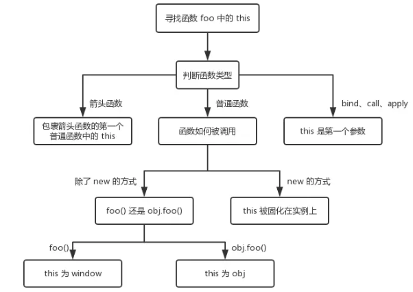

> this 的值是在执行的时候才能确认，定义的时候不能确认

```
// 情况1
function foo() {
  console.log(this.a) //1
}
var a = 1
foo()

// 情况2
function fn(){
  console.log(this);
}
var obj={fn:fn};
obj.fn(); //this->obj

// 情况3
function CreateJsPerson(name,age){
//this是当前类的一个实例p1
this.name=name; //=>p1.name=name
this.age=age; //=>p1.age=age
}
var p1=new CreateJsPerson("尹华芝",48);

// 情况4
function add(c, d){
  return this.a + this.b + c + d;
}
var o = {a:1, b:3};
add.call(o, 5, 7); // 1 + 3 + 5 + 7 = 16
add.apply(o, [10, 20]); // 1 + 3 + 10 + 20 = 34

// 情况5
<button id="btn1">箭头函数this</button>
<script type="text/javascript">
    let btn1 = document.getElementById('btn1');
    let obj = {
        name: 'kobe',
        age: 39,
        getName: function () {
            btn1.onclick = () => {
                console.log(this);//obj
            };
        }
    };
    obj.getName();
</script>
```
解释上面的几种情况：
- 在全局环境下，直接被调用，this 指向windows
- 对于 obj.foo() 来说，我们只需要记住，谁调用了函数，谁就是 this，所以在这个场景下 foo 函数中的 this 就是 obj 对象
- 在构造函数模式中，类中(函数体中)出现的 this.xxx=xxx 中的 this 是当前类的一个实例
- call、apply 和 bind：this 是第一个参数
- 箭头函数 this 指向:箭头函数没有自己的 this，看其外层的是否有函数，如果有，外层函数的 this 就是内部箭头函数的 this，如果没有，则 this 是 window。

