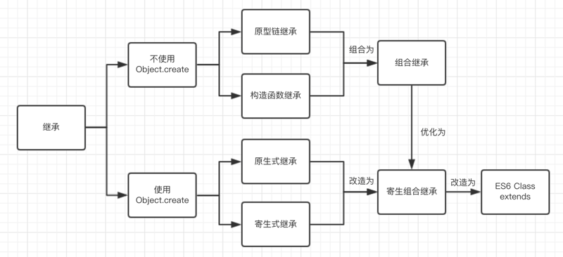

### 原型链继承

```
SubType.prototype = new SuperType() 
// 所有涉及到原型链继承的继承方式都要修改子类构造函数的指向，否则子类实例的构造函数会指向SuperType。
SubType.prototype.constructor = SubType;
```

核心： 让新实例的原型 等于父类的实例

优点: 父类可以复用
缺点：
- 父类的引用属性会被所有子类实例共享
- 子类构建实例时不能向父类传递参数

### 构造函数继承
核心：将父类构造函数的内容复制给了子类的构造函数。这是所有继承中唯一一个不涉及到prototype的继承。

```
SuperType.call(SubType);
```

优点：和原型链继承完全反过来。

父类的引用属性不会被共享

子类构建实例时可以向父类传递参数

缺点：父类的方法不能复用，子类实例的方法每次都是单独创建的。

### 组合继承

核心：原型式继承和构造函数继承的组合，兼具了二者的优点。


```
function SuperType() {
    this.name = 'parent';
    this.arr = [1, 2, 3];
}

SuperType.prototype.say = function() { 
    console.log('this is parent')
}

function SubType() {
    SuperType.call(this) // 第二次调用SuperType
}

SubType.prototype = new SuperType() // 第一次调用SuperType

```

优点：

父类的方法可以被复用

父类的引用属性不会被共享

子类构建实例时可以向父类传递参数

缺点：

调用了两次父类的构造函数，第一次给子类的原型添加了父类的name, arr属性，第二次又给子类的构造函数添加了父类的name, arr属性，从而覆盖了子类原型中的同名参数。这种被覆盖的情况造成了性能上的浪费。

### 原型式继承
核心：原型式继承的object方法本质上是对参数对象的一个浅复制。

优点：父类方法可以复用

缺点：

父类的引用属性会被所有子类实例共享
子类构建实例时不能向父类传递参数
```
    function object(o){
        function F(){}
        F.prototype = 0;
        return new F();
    }
    var person = {
        name: "Nicholas",
        friends: ["Shelby", "Court", "Van"]
    };

    var anotherPerson = object(person);
    anotherPerson.name = "Greg";
    anotherPerson.friends.push("Rob");

    var yetAnotherPerson = object(person);
    yetAnotherPerson.name = "Linda";
    yetAnotherPerson.friends.push("Barbie");
    alert(person.friends);   //"Shelby,Court,Van,Rob,Barbie"
```
> ECMAScript 5 通过新增 Object.create()方法规范化了原型式继承。这个方法接收两个参数:一 个用作新对象原型的对象和(可选的)一个为新对象定义额外属性的对象。在传入一个参数的情况下， Object.create()与 object()方法的行为相同。——《JAVASCript高级编程》

> 一个比较明显的区别就是clone函数接收的参数不一定要是构造函数,也可以是其他任何对象, 这样我们就相当于是浅复制了一个对象.


### 寄生式继承
核心：使用原型式继承获得一个目标对象的浅复制，然后增强这个浅复制的能力
```
function createAnother(original){ 
    var clone=object(original);    //通过调用函数创建一个新对象
    clone.sayHi = function(){      //以某种方式来增强这个对象
        alert("hi");
    };
    return clone;                  //返回这个对象
}

var person = {
    name: "Nicholas",
    friends: ["Shelby", "Court", "Van"]
};

var anotherPerson = createAnother(person);
anotherPerson.sayHi(); //"hi"
```

### 寄生组合式继承
```
function inheritPrototype(subType, superType){
    var prototype = object(superType.prototype); // 创建了父类原型的浅复制
    prototype.constructor = subType;             // 修正原型的构造函数
    subType.prototype = prototype;               // 将子类的原型替换为这个原型
}

function SuperType(name){
    this.name = name;
    this.colors = ["red", "blue", "green"];
}

SuperType.prototype.sayName = function(){
    alert(this.name);
};

function SubType(name, age){
    SuperType.call(this, name);
    this.age = age;
}
// 核心：因为是对父类原型的复制，所以不包含父类的构造函数，也就不会调用两次父类的构造函数造成浪费
inheritPrototype(SubType, SuperType);
SubType.prototype.sayAge = function(){
    alert(this.age);
}
```


###  ES6 Class extends
核心： ES6继承的结果和寄生组合继承相似，本质上，ES6继承是一种语法糖。但是，寄生组合继承是先创建子类实例this对象，然后再对其增强；而ES6先将父类实例对象的属性和方法，加到this上面（所以必须先调用super方法），然后再用子类的构造函数修改this

```
class A {

}

class B {

}

object.setprototypeOf = function (obj,proto){
    obj._proto_ = proto;
    return obj;
}

// B 的实例继承 A 的实例
Object.setPrototypeOf(B.prototype, A.prototype);

// B 的实例继承 A 的实例
Object.setPrototypeOf(B, A);
```

ES6继承与ES5继承的异同：

相同点：本质上ES6继承是ES5继承的语法糖

不同点：

ES6继承中子类的构造函数的原型链指向父类的构造函数，ES5中使用的是构造函数复制，没有原型链指向。

ES6子类实例的构建，基于父类实例，ES5中不是。
