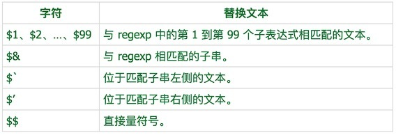

### 正则基本语法 

#### 1 修饰符
- g : 全局搜索
- i ：不分大小写搜索
- m : 多行匹配

#### 2 元字符
正则表达式由两种基本字符类型组成：

- 原义文本字符串
- 元字符

元字符是正则表达式中含有特殊含义的非字母字符：
- \：转义，将具有特殊意义的元字符转成原义文本字符
- .：除了换行以外的所有字符
- +：至少一个，一次或者多次
- ?：至多一次，零或者一次
- *：任意次
- $：以 ... 结尾
- ^：字符类取反、或者以 ... 开头
- |：或
- ()：分组
- {}：用来包裹量词范围
- []：用来包裹字符类

\n 换行符 \r 回车符

#### 字符类

如果我们需要匹配一类字符，可以使用元字符 [] 来构建一个简单的类。所谓的类是指符合某些特性的对象，是一个泛指。如 [abc] 把字符 a 或 b 或 c 归为一类，只要有里面的一个，就能匹配。

```
'a1b2c3c'.replace(/[abc]/g, 'X'); // 'X1X2X3X'
```

中括号中的 - 有特殊含义，一般需要放在后面或者前面来代表本义
中括号中出现两位数，不是两位数，而是代表两个数中的任意一个

```
let reg = /^[12-65]$/g //=> 表示 1 或者 2-6 或者 5
```
#### 字符类取反
```
'a1b2c3c'.replace(/[^abc]/g, 'X'); // 'aXbXcXc'
```
#### 范围类
使用 - 来连接两个字符，如 [a-z] 表示从 a 到 z 的任意字符，这是一个闭区间，包含 a 和 z 本身。
```
'a1b2d3x4z9'.replace(/[a-z]/g, 'Q'); // 'Q1Q2Q3Q4Q9'
```
#### 预定义类

字符|等价类|含义
--|:--:|--:
.	|[^\r\n]	| 除了回车符和换行符之外的所有字符
\d	|[0-9]	|数字字符
\D	|[^0-9]	|非数字字符
\s	|[\t\n\x0B\f\r]	|空白字符
\S	|[^\t\n\x0B\f\r]	|非空白字符
\w	|[a-zA-Z_0-9]	|单词字符（字母、数字、下划线）
\W	|[^a-zA-Z_0-9]	|非单词字符

```
// 单词边界
'This is a boy'.replace(/is/g, '0'); // 'Th0 0 a boy'
'This is a boy'.replace(/\bis\b/g, '0'); //  'This 0 a boy'
'This is a boy'.replace(/\Bis\b/g, '0'); // 'Th0 is a boy'
```

#### 量词
- ?：出现零次或者一次（最多一次）
- +：出现一次或多次（至少出现一次）
- *：出现零次或者多次（任意次）
- {n}：出现 n 次
- {n,m}：出现 n 到 m 次
- {n,}：至少出现 n 次

> 注意：量词只作用于紧挨它的前一个正则字符

默认正则表达式都是贪婪模式。如果需要实现非贪婪模式，只需要在量词后加上 ? 即可。


```
// 贪婪模式
'123456789'.replace(/\d{3,6}/g, 'X'); // 'X78'
// 非贪婪模式
'123456789'.replace(/\d{3,6}?/g, 'X'); // 'XX78'
```

#### 分组

如果要匹配 destiny 连续出现的场景，如果使用 destiny{3}，那么只会匹配到 destinyyy，而不是 destinydestinydestiny。
这时就需要使用 () 分组，使量词作用于分组。(destiny){3}

```
//=> 如果只是想要匹配 18 或 19
let reg = /^(18|19)$/
```

#### 分组捕获

```
'2018-05-11'.replace(/(\d{4})-(\d{2})-(\d{2})/g, '$2/$3/$1'); //=> 05/11/2018
```

#### 分组引用
正则中，使用 \1、\2 等，来引用正则中出现的分组捕获的内容

```
//=> 匹配到四个字符的字母，其中第一个与最后一个一样，第二位与倒数第二位一样
let reg = /^([a-Z])([a-Z])\2\1$/;
'oppo' //=> true
'abba' //=> true
```

#### 忽略分组

如果不希望捕获某些分组，只需要在分组内加上 ?:就可以，如 (?:Byron).(ok)，这时，$1 就捕获 ok 分组匹配的内容


名称	| 正则
--  |   --:

正向前瞻 | exp(?=assert)
负向前瞻 | exp(?!assert)

正向前瞻：例 \w(?=\d)，在是单词的基础上向前判断后面紧跟的是否是数字，这里只匹配单词，后面括号内的只是判断单词是否符合条件。

```
'a2*3'.replace(/\w(?=\d)/g, 'X'); // 'X2*3'

'a2*34v8'.replace(/\w(?=\d)/g, 'X'); // 'X2*X4X8'
```

负向前瞻：例 \w(?!\d)，在单词的基础上向前判断后面紧跟的是否不是数字，这里也是只匹配单词，后面的只是判断条件。

```
'a2*3'.replace(/\w(?!\d)/g, 'X'); // 'aX*3'

'a2*34v8'.replace(/\w(?!\d)/g, 'X'); // 'aX*3XvX'
```

### 正则的使用

正则，就是用来处理字符串的一种规则
- 正则只能用来处理字符串
- 处理一般包含两个方面
    - 验证字符串是否符合某个规则，正则匹配
    - 把一个字符串符合规则的字符获取到，正则捕获
- 使用正则实例的方法，需要传入字符串
- 使用字符串实例的方法，需要传入正则

#### 正则的方法

#### test 匹配

（1）正则中没有全局匹配时，每次都是从开头匹配，只要有符合的就返回 true

（2）正则中有全局匹配的时候，每次都会从 reg.lastIndex 索引开始匹配，只要匹配到后面都没有，则返回 false，此时索引会重置。与 exec 方法一样。

```
var reg = /\d{2}/g;
var str = 'a11a11';
reg.test(str); //=&gt; true
reg.test(str); //=&gt; true
reg.test(str); //=&gt; false
```

> 需要注意的是：
    1.  当它遍历到最后，再使用此方法，会返回有一个 null，此时 reg.lastIndex 也会重置回 0，之后又会从开头重新遍历
    2.  使用同一个正则，那么其记录的 reg.lastIndex 是一样的，与字符串无关，这样就会出现不可预料的结果
    3.  使用同一个正则的 test 或 exec 方法，也是相同的 reg.lastIndex，就会相互影响，结果不可预料
    4. 由于 exec 没有办法一次捕获所有匹配的字符串，同时也存在检测不同字符时，不是从开头匹配的 bug 
    5. 所以，需要自己写一个 execAll 方法，捕获了所有的匹配字符串，并且最终索引都会回到最初。

```
RegExp.prototype.execAll = function (str) {
  var temp;
  //=&gt; 防止后面出现死循环，若没有全局修饰符，直接给它返回匹配到的第一个
  if(!this.global) {
    temp = this.exec(str);
    temp.errorReason = &quot;你没有添加全局修饰符&quot;;
    return temp;
  }
  var ary = [];
  temp = this.exec(str);
  while (temp) { //=&gt; 当 exec 没有捕获到时，返回 null，同时索引置回最初
    ary.push(temp[0]);
    temp = this.exec(str);
  }
  return ary;
}
```

### 字符串的方法

match 匹配

match 方法用于确定原字符串是否匹配某个子字符串，返回一个数组，成员为匹配的第一个字符串。如果没有找到匹配，则返回 null。

```
'cat, bat, sat, fat'.match('at') // [at]
'cat, bat, sat, fat'.match('xt') // null
```

返回数组还有 index 属性和 input 属性，分别表示匹配字符串开始的位置和原始字符串。

match 方法还可以使用正则表达式作为参数，行为在很大程度上有赖于 regexp 是否具有标志 g。
（1）如果 regexp 没有标志 g，就只能在源字符串中执行一次匹配。与 exec 一样
- 如果没有找到任何匹配的文本， 返回 null。
-  否则，它将返回一个数组，其中存放了与它找到的匹配文本有关的信息。
- 该数组的第 0 个元素存放的是匹配文本，而其余的元素存放的是正则的分组捕获到的内容
- 返回的数组还含有两个对象属性。index 属性声明的是匹配文本的起始字符在源字符串中的位置，input 属性声明的是对源字符串的引用。

- （2）如果 regexp 具有标志 g，将执行全局检索，找到源字符串中的所有匹配子字符串。
- 若没有找到任何匹配的子串，返回 null
- 如果找到了一个或多个匹配子串，则返回一个数组。
- 全局匹配返回的数组的内容与前者大不相同，它的数组元素中存放的是源字符串中所有的匹配子串，不再捕获分组
- 没有 index 属性或 input 属性。

> 注意：在全局检索模式下，match() 不提供与子表达式匹配的文本的信息，也不声明每个匹配子串的位置。如果您需要这些全局检索的信息，可以使用 exec()。 

#### split 分割

```
var reg = /[,+-]/;
var str = 'aa,bb+cc-aa';
str.split(reg);  => ["aa", "bb", "cc", "aa"]

var reg = /[,+-]/g;
var str = 'aa,bb+cc-aa';
str.split(reg); => ["aa", "bb", "cc", "aa"]
```

split 方法把字符串按照指定字符串进行分割成数组。传入的参数也可以是正则表达式。
传入参数是正则表达式的时候，会按照正则匹配到的字符串进行分割。
不管有没有全局匹配，都是按照全局搜索去匹配的。

####  replace 替换

replace 用于将某个字符串替换成另外一个字符串，只会替换第一个。传入的第一个参数可以是正则表达式，此时会替换掉匹配到的字符串

#### 第一个参数是正则，第二个参数是字符串
```
var str2 = '这是一段原始文本，需要替换的内容"ac这要替换bb"！';
var newStr = str2.replace( /([a-z])+/g,'qqq' );
console.log( newStr );    //输出：   这是一段原始文本，需要替换的内容"qqq这要替换qqq"！
```
#### 第一个参数是正则，第二个参数是带$符的字符串
```
var str3 = '这是一段原始文本,"3c这要替换4d"!';
var newStr = str3.replace( /([0-9])([a-z])/g,"$1" );
console.log( newStr );    //输出：    这是一段原始文本,"3这要替换4"!';
```


####  第一个参数是正则，第二个参数函数
```
var str4 = '这是一段原始文本，需要替换的内容"aa这要bbb替换ccccc"！';
var newStr = str4.replace( /[a-z]+/g,function ($0){
    var str = '';
    for (var i = 0; i < $0.length; i++) {
        str += '*';
    };
    return str;
} );
console.log( newStr );    //这是一段原始文本，需要替换的内容"**这要***替换*****"！

```


#### 第一个参数是正则且有子表达式，第二个参数函数且带有多个参数

```
var str5 = '这是一段原始文本，需要替换的内容"3c这要替换4d"！';
var newStr = str5.replace( /([0-9])([a-z])/g,function (arg1,arg2,arg3,arg4,arg5){
 console.log( arg1 );
  console.log( arg2 );
  console.log( arg3 );
  console.log( arg4 );
  console.log( arg5 );
} );
//输出：
3c
3
c
17
这是一段原始文本，需要替换的内容"3c这要替换4d"！
4d
4
d
23
这是一段原始文本，需要替换的内容"3c这要替换4d"！

```


上面的例子第一个参数arg1表示匹配的整体，arg2表示第一个子表达式，arg3表示第二个子表达式，接下来的参数arg4是一个整数，声明了表示子匹配在 stringObject 中出现的位置。最后一个参数是 stringObject 本身。

#### 正则的懒惰性

正则的捕获有懒惰性：只能捕获到第一个匹配的内容，剩余的默认捕获不到

正则的懒惰性与正则的 lastIndex 属性有关，它代表正则捕获的时候，下一次在字符串中开始查找的索引。

解决正则捕获的懒惰性，需要添加全局修饰符 g，这个是唯一的方法，而且不加 g，不管用什么办法捕获，也都不能把全部匹配捕获到。

#### 正则的贪婪性

出现量词的时候，每次匹配捕获的时候，总是捕获到和正则匹配中最长的内容。

```
let str = 'aa2018';
let reg1 = /\d+/g;
reg1.exec(str); //=&gt; '2018'
//=&gt; 把问号放在量词元字符后面，代表的就不是出现零次或者一次了，而是取消捕获的贪婪性
let reg2 = /\d+?/g;
reg2.exec(str); //=&gt; '2'
```